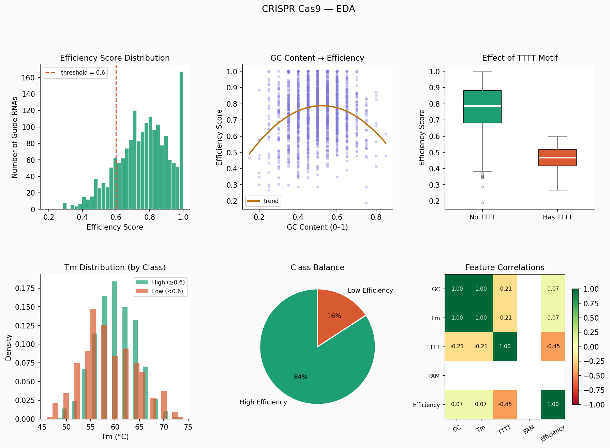

# crispr-efficiency-prediction
Initial EDA on 1,800 guide RNAs revealed:
 
- Guide RNAs containing **TTTT repeats** show mean efficiency of **0.47**, compared to **0.78** for those without — the strongest signal found so far
- GC content shows a mild positive correlation with efficiency (r = 0.07), consistent with the literature
- Class imbalance: ~84% of guides are high-efficiency — this will require careful handling during model evaluation
 

 
---
 
## Open questions
 
- Which sequence features matter most? (Feature importance analysis in Week 3)
- Does position within the guide RNA matter — e.g., are GC bases at the seed region more informative than at the 5' end?
- How does the model perform on guides targeting different gene families?
 
These questions will guide the next phases of the project.
 
---
 
## Stack
 
Python 3 · pandas · scikit-learn · matplotlib · biopython
